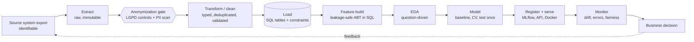

# 00 · The data lifecycle (the map)

Every later document zooms into one box of this map. All numbers in these docs come from a run on
**synthetic data** (`claimvalue pipeline --n 20000`, seed 42). They show *how to read* results, not
real-world performance.



## Vocabulary (what interviewers mean)

| Term | One-line meaning | Where here |
|---|---|---|
| **ETL / ELT** | Extract, Transform, Load. ELT loads raw first and transforms inside the warehouse (Spark/dbt) | `synthetic.py` -> `anonymize.py` -> `db.py` (ETL) |
| **Data munging / wrangling** | Hands-on reshaping: parse, join, pivot, window, aggregate | `sql/03_abt.sql`, `features.py` |
| **Data cleaning** | Fixing or flagging wrong data: duplicates, invalid values, missing, inconsistent | `db.py`, `sql/01_schema.sql`, `sql/02_data_quality.sql` |
| **Data processing** | Any automated transformation step; also "batch vs stream" | the whole pipeline (batch) |
| **Feature engineering** | Turning cleaned data into model inputs | rolling-window SQL, encoders in `features.py` |
| **ABT** | Analytical Base Table: one row per prediction unit, features known *before* the target | `load_abt()` |
| **EDA** | Exploring data to decide what to do next (not to make charts) | `eda.py` |
| **Leakage** | Information in training that would not exist at prediction time | `docs/04_ml.md` |
| **Lineage** | Being able to say where each number came from | `data_fingerprint`, `privacy_report.json`, MLflow tags |

## Stage map: module, output, control

| # | Stage | Module / file | Output | Control that protects you |
|---|---|---|---|---|
| 1 | Extract | `RAW_DATA_DIR` (outside repo) | raw export | encrypted volume, never committed (`.gitignore`, pre-commit hook) |
| 2 | Anonymize | `anonymize.py` | `cases_anonymized.csv`, `privacy_report.json` | `assert_no_pii`, risk metrics, secrecy exclusion |
| 3 | Clean + load | `db.py`, `sql/01_schema.sql` | `cases` table | CHECK constraints, PK, outcome mapping fails on unknown values |
| 4 | Quality report | `sql/02_data_quality.sql` | 1-row profile | read it after every load |
| 5 | Build ABT | `sql/03_abt.sql` | features per case | only history decided before filing date |
| 6 | EDA | `eda.py` | tables, figures, report | `id_like_columns`, missingness by group |
| 7 | Train | `train.py` | model + metadata | time split, CV on train only, dummy baseline, bootstrap CI |
| 8 | Serve | `api.py`, `Dockerfile` | `/predict/*` | API key, input validation, non-root container |
| 9 | Track | MLflow, `*.json` metadata | runs, fingerprints | reproducibility |

## Principles behind every choice

1. **Raw is immutable.** Never edit the export; derive everything from it so any step can be rerun.
2. **Idempotent steps.** Running a step twice gives the same result (the schema drops and rebuilds).
3. **Fail loudly and early.** Constraints and `assert_no_pii` stop bad data at the door, not in the model.
4. **Time is a first-class citizen.** Split, features and labels all respect "what was known when".
5. **Measure against a baseline.** A number without a dummy model next to it means nothing.
6. **Document decisions, not just code.** Each doc has a "why" column on purpose.

## Run it

```bash
cp .env.example .env      # set ANONYMIZATION_PEPPER (openssl rand -hex 32), API_KEY
pip install -e ".[dev,api,eda]"
claimvalue pipeline --n 20000     # generate -> anonymize -> SQL -> EDA -> train -> anomalies -> PII check
```
