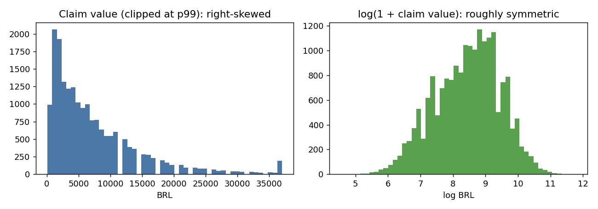
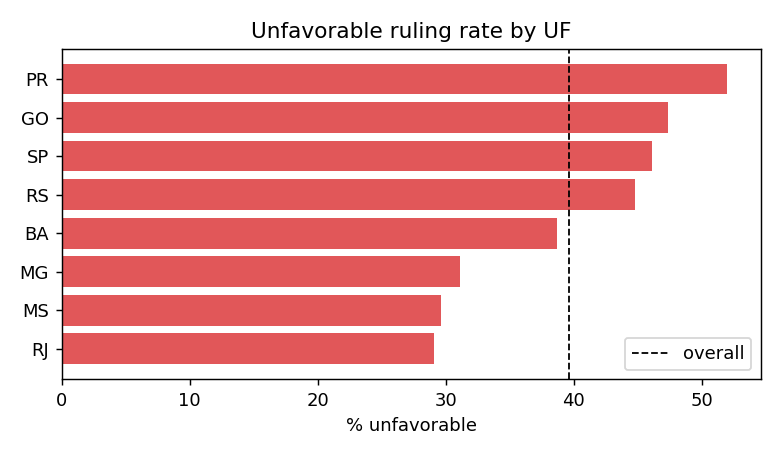
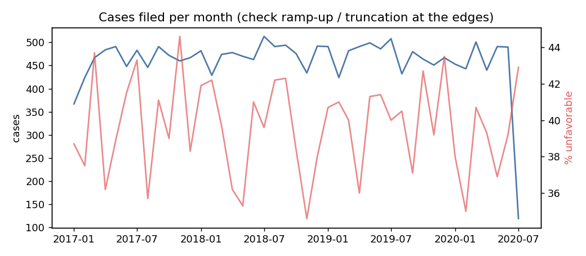
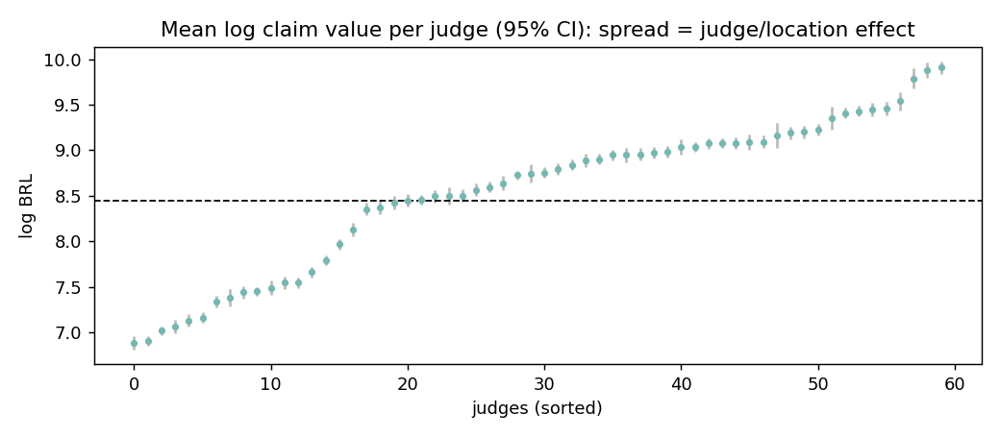

# 03 · Exploratory data analysis (EDA)

EDA exists to **decide what to do next**: which columns to trust, what to transform, where the model
will be weak, which hypotheses are worth testing. A chart that changes no decision is decoration.

## Do EDA at four moments, not once

| Moment | Question | Tool here |
|---|---|---|
| 1. Raw profile | Is the data what we were told? | `overview()`, quality SQL |
| 2. Cleaned | What do distributions and missingness look like? | `target_summary()`, `missingness()` |
| 3. ABT (features vs target) | Which features carry signal? Any leakage? | `spearman_with_target()`, `id_like_columns()`, `variance_explained()` |
| 4. After modelling | Where does the model fail? | `slice_report()` (error by UF), residuals |

Run it: `claimvalue eda` writes tables, figures and `EDA_REPORT.md`.

## Findings from the synthetic run and what each one means

| Finding | Evidence | So what (decision) |
|---|---|---|
| Claim value is right-skewed | skew 3.09 raw, -0.23 after log; mean 7,345 vs median 5,100 | model on log scale, report MAE *and* median error; never describe the "average claim" without the median |
| Only `case_id` is identifier-like | `id_like_columns` | exclude it. In the original code the per-case key `PJ` was one-hot encoded, which lets a tree memorise rows |
| Judge explains the most variance | eta squared: judge 0.64, vara 0.50, comarca 0.21, uf 0.12 | judge-level history is the key feature; but see the nesting warning below |
| `judge_avg_value_prior` correlates 0.76 (Spearman) with log claim | `spearman_with_log_claim` | the rolling-window feature works: past decisions predict future values |
| `filing_month` correlation about 0 | 0.007 | seasonality is not a driver here; candidate to drop |
| 3% of targets missing | quality report | check it is not concentrated in one UF before dropping |
| 39.6% unfavorable | base rate | a model that always says "favorable" scores 60.8% accuracy; accuracy alone is a trap |

## Pitfalls EDA must protect you from

| Pitfall | Example | Antidote |
|---|---|---|
| **Correlating arbitrary codes** | Correlation between a judge's integer id and claim value (the original notebook got 0.06) is meaningless: the code order is arbitrary | never correlate label-encoded categories; use group means, eta squared, or target encoding |
| **Nested effects look additive** | each judge sits in one comarca and vara, so judge, comarca and vara effects overlap (the eta squared values are upper bounds and do not sum to 1) | state that the model cannot separate "this judge" from "this court" |
| **Correlation is not causation** | high claims before a judge does not mean the judge causes high claims | frame results as prediction, not attribution |
| **Simpson's paradox** | overall unfavorable rate differs from every sub-group trend when group sizes differ | always slice by the main grouping |
| **Looking at the test set** | tuning on what you saw | do EDA on the training period only for modelling decisions |
| **Survivorship / truncation** | recent months have fewer *decided* cases | inspect volume over time at both edges; the label purge in `temporal_split` handles it |

## EDA question list (copy for any project)

1. What is one row? What is the grain? Is the key unique?
2. What is the target's distribution, range, units, and skew?
3. What is missing, how much, where, and why?
4. Which columns are identifiers, constants, or near-duplicates?
5. Which features relate to the target, and is that relationship plausible?
6. How does behaviour change over time? Is the future like the past?
7. Which sub-groups behave differently?
8. What would make this analysis wrong?
